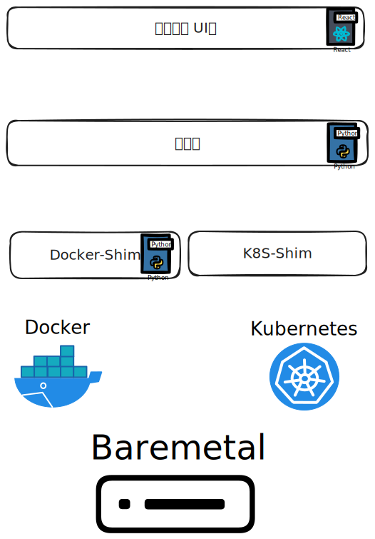

# 架构设计

## 项目结构

项目使用三层结构，分解为：
1. UI层
2. 编排层
3. 资源层

### UI层

UI层即用户界面层，提供用户交互，包括：

1. User、Orgnization、Network、Membership、Environment的管理
2. Environment的部署、启动、停止、删除——通过填写表单实现

### 编排层

编排层即编排服务层，提供编排服务，包括：

1. User、Orgnization、Network、Membership、Environment的实际业务处理
2. Environment的操作的分解、编排、执行——通过资源层实现

### 资源层

资源层即资源服务层，直接控制裸机资源，向编排层提供资源服务，包括：

1. 创建、删除、启动、停止、查询资源

通过资源层向编排层提供一致的资源服务，使编排层可以对不同的资源环境进行适配，包括裸机、Docker、Kubernetes、虚拟机等。

## 实现方案

### UI层

计划使用React实现。

### 编排层

其中有较为复杂的资源模型关系，因而使用Django进行实现。

### 资源层

资源层不存在数据库，直接使用FastAPI实现。
