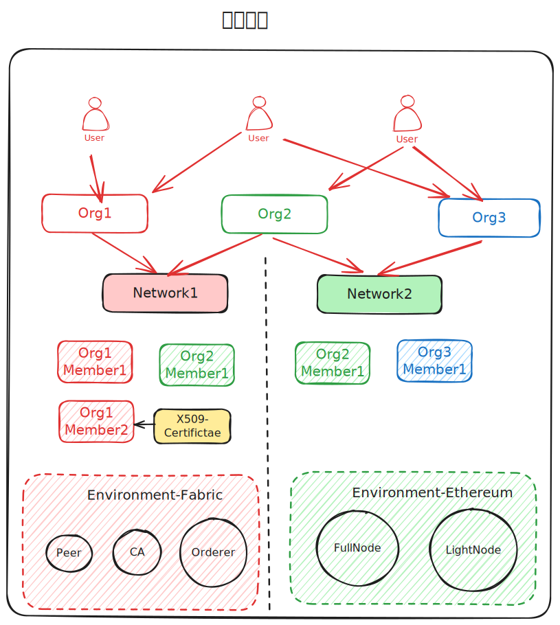

# 系统资源模型

LoLeido系统资源模型，主要包括以下几个部分：

0. User
1. Orgnization：
2. User：
3. Network：
4. Membership
5. Environment

## User

User即BaaS系统的用户。

## Orgnization

Orgnization即BaaS系统的组织，一个组织可以包含多个用户，一个用户可以属于多个组织，并于其中担任不同的角色，以获得不同的权限。

## Network

Network即Organization间的联盟网络，一个联盟网络可以包含多个组织，一个组织可以参与多个联盟网络。

## Membership

Membership即Organization参与Network的形式，一个组织可以在一个联盟网络中拥有多个Membership，一个Membership只能属于一个组织。

## Environment

Environment是系统区块链资源的具体实例，提供最终的区块链服务。

根据不同的配置，Environment可以组合一下选项：

1. 区块链协议：`fabric`、`sawtooth`、`ethereum`、`hyperledger`、`bitcoin`等，决定了区块链中区块与交易的数据结构。
2. 区块链节点实现：`Besu`、`Fabric`、`Sawtooth`、`Geth`、`Parity`、`Hyperledger`、`Bitcoin`等，决定了区块链节点的实现。
3. 共识算法：`PoW`、`PoS`、`PoA`、`PBFT`、`Raft`、`CFT`、`BFT`等，决定了区块链中区块达成一致的方式。